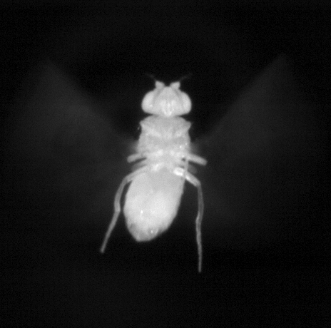
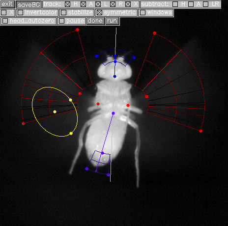

# Benifly
Offline version of Kinefly for Windows/Linux without ROS

## Introduction
[**Benifly**](https://github.com/bmslpsu/Benifly) is based on [**Kinefly**](https://github.com/ssafarik/Kinefly) software developed by [Steve Safarik](https://github.com/ssafarik), which was designed for tracking tethered insect kiematics in real time. While Kinefly is designed for ROS, which requires a Linuxed based OS, Benifly only requires [Python 2](https://www.python.org/downloads/release/python-273/), so any recent Windows OS is appropriate. Benifly maintains the majority of Kinefly's core functionality, including virtually all image processing algorithms and error handling. However, instead of taking in an image stream from a camera in real-time, Benifly reads in previously recorded video files (tested for .avi,.mp4, & MATLAB data).

##### Disclamer
Benifly is by no means a finished & bug-free software. If you try hard enough, it can be broken.

## Installation
Benifly is simply a collection of Python classes and functions that can be called to perform various computer vision alogorithms, thus there are no special installion requirements. The repository should simply be cloned into a directory of your choosing, and the Python path should be set to include all modules in the main Benifly directory. It is highly reccomended that users install an integrated development environment (IDE) to manage modules and packages ([Pycharm](https://www.jetbrains.com/pycharm/) & [Visual Studios](https://visualstudio.microsoft.com/) work well).

Benifly requires the following external Python packages:
* **opencv-python**   (for various image processing processes)
* **numpy**     (to handle numeric data & calculations)
* **h5py**      (to load .mat files)

## Operation
### General
**It is recommended that users start by reading [Kinefly documentation](https://github.com/ssafarik/Kinefly) to understand the basic functionality of the software.**

The first Python file that should be run is `BatchBenifly.py`. This is a simple script that constructs a Benifly object and calls it's methods. The user can specify which video files to feed to Benifly, where to save the output, and what specific method they would like to use (detailed below). Once the user becomes familiar with how Benifly works, he or she can write their own version of this script to suit his or her data processing needs.

The user can set the following variables:
 * `root`: directory where video files are located
 * `filespec`: this can be a file name or partial file name that reads in all files with the filespec
 * `targetdir`: directory to save Benifly output
 * `vidname`: the name of the video data variable in the .mat file (necessary for MATLAB videos only)
 
 It is recommended that `root` & `targetdir` be different directories to avoid naming conflicts.
 
 ### Main Classes & Methods
 Currently, the main class `Benifly.py` has five methods that can be called.
 
 #### 1. `Benifly.loopMat(root, file, vidname)`
 Will continuously track a MATLAB  `.mat` video in a file located in the `root` with filename `file` until stopped by the user. There is no output, which is useful for setting masks & other parameters before tracking. The input parameter `vidname` must be the MATLAB variable that the video is stores under. Note that the video must be in grayscale form (3D matrix).
 
  #### 2. `Benifly.runMat(root, file, vidname, targetdir)`
 Works just like like `Benifly.matLoop()`, but will track a video stored in a `.mat` file **and** output data to the `targetdir`(tracking only runs once & is no longer continuous).
  
  #### 3. `Benifly.loopVid(root, file, vidname)`
 Works just like like `Benifly.runMat()`, but takes a video format file (`.avi`, .`mp4`, `.mov`, etc.) instead of a `.mat` file.
 
  #### 4. `Benifly.runVid(root, file, vidname, targetdir)`
 Works just like like `Benifly.runMat()`, but takes a video format file (`.avi`, .`mp4`, `.mov`, etc.) instead of a `.mat` file.
 
  #### 5. `Benifly.loopLive()`
 Works just like `Benifly.loopMat()` but takes a video format file (`.avi`, .`mp4`, `.mov`, etc.) instead of a `.mat` file.
 
 ### Output
 Benifly methods that save data output two files:
 * `filename.csv`: contains the head, abdomen,left & right wing angles for all frames of the input video
 * `filename.avi`: the saved Kinefly video feed
 
 For both output files, `filename` is will be the same name as the video file fed to Benifly.
 
 ## Example  tracked frame
 Input:
 
 
 
 Output:
 
 