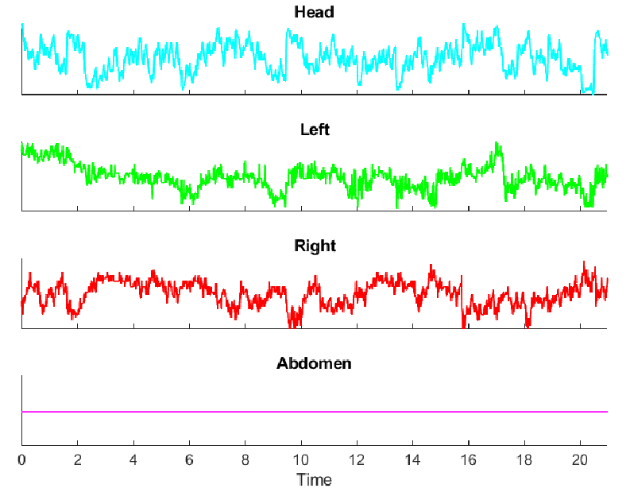

# Benifly
Offline version of *Kinefly* for Windows/Linux without ROS

## Introduction
[**Benifly**](https://github.com/bmslpsu/Benifly) is based on [**Kinefly**](https://github.com/ssafarik/Kinefly) software developed by [Steve Safarik](https://github.com/ssafarik), which was designed for tracking tethered insect kiematics in real time. While *Kinefly* is designed for ROS, which requires a Linuxed based OS, *Benifly* only requires [Python 2](https://www.python.org/downloads/release/python-273/), so any recent Windows OS is appropriate. *Benifly* maintains the majority of *Kinefly's* core functionality, including virtually all image processing algorithms and error handling. However, instead of taking in an image stream from a camera in real-time, *Benifly* reads in previously recorded video files (tested for .avi,.mp4, & MATLAB data).

The BMSL Lab also maintains a [Kinefly repository](https://github.com/bmslpsu/Kinefly) that has been tested for Ubuntu 16.04 & ROS Kinetic and Ubuntu 18.04 & ROS Melodic.

##### Disclamer
*Benifly* is by no means a finished & bug-free software. If you try hard enough, it can be broken.

## Installation
*Benifly* is simply a collection of Python classes and functions that can be called to perform various computer vision alogorithms, thus there are no special installion requirements. The repository should simply be cloned into a directory of your choosing, and the Python path should be set to include all modules in the main *Benifly* directory. It is highly reccomended that users install an integrated development environment (IDE) to manage modules and packages ([Pycharm](https://www.jetbrains.com/pycharm/) & [Visual Studios](https://visualstudio.microsoft.com/) work well).

*Benifly* requires the following external Python packages:
* **opencv-python**   (for various image processing processes)
* **h5py**      (to load .mat files)
* **numpy**     (to handle numeric data & calculations)

## Operation
**It is recommended that users start by reading [Kinefly documentation](https://github.com/ssafarik/Kinefly) to understand the basic functionality of the software.**

The first Python file that should be run is `BatchBenifly.py`. This is a simple script that constructs a *Benifly* object and calls it's methods. The user can specify which video files to feed to *Benifly*, where to save the output, and what specific method they would like to use (detailed below). Once the user becomes familiar with how *Benifly* works, he or she can write their own version of this script to suit his or her data processing needs.

The user can set the following variables:
 * `mainroot`: directory where *Benifly* is located
 * `root`: directory where video files are located
 * `filespec`: this can be a file name or partial file ; *BatchBenifly* reads in all files with the filespec
 * `targetdir`: directory to save output
 * `vidname`: the name of the video data variable in the .mat file (necessary for MATLAB videos only)
 
 It is recommended that `root` & `targetdir` be different directories to avoid naming conflicts.
 
 ### Main Classes & Methods
 Currently, the main class `Benifly.py` has five methods that can be called.
 
 
 #### 1. `loopMat(root, file, vidname)` 
 Will continuously track a MATLAB  `.mat` video in a file located in the `root` with filename `file` until stopped by the user. There is no output, which is useful for setting masks & other parameters before tracking. The input parameter `vidname` must be the MATLAB variable that the video is stored under. Note that the video must be in grayscale form (3D matrix).
 
  #### 2. `runMat(root, file, vidname, targetdir)`
 Works just like like `matLoop()`, but will track a video stored in a `.mat` file **and** output data to the `targetdir`(tracking only runs once & is no longer continuous).
  
  #### 3. `loopVid(root, file)`
 Works just like like `loopMat()`, but takes a video format file (`.avi`, .`mp4`, `.mov`, etc.) instead of a `.mat` file.
 
  #### 4. `runVid(root, file, vidname, targetdir)`
 Works just like like `runMat()`, but takes a video format file (`.avi`, .`mp4`, `.mov`, etc.) instead of a `.mat` file.
 
  #### 5. `loopLive()`
 Works just like `loopMat()` but reads in an image stream from the first default usb camera device. Not very useful right now, but can be used for debugging if video files are not loading.
 
 ### Output
 *Benifly* methods that save data (`runMat()`,`runVid()`) output two files:
 * `filename.csv`: contains the head, abdomen, and left & right wing angles for all frames of the input video. There are other outputs from *Benifly* that are not currently designed to be saved, such as the radii & gradients for each body part.
 * `filename.avi`: the saved *Binefly* video feed with tracking illustrations
 
 For both output files, `filename`  will be the same as the name of the video file fed to *Benifly*.
 
 ### Setting & Saving Parameters
 The `params.json` file in the *Benifly* root directory stores all startup information for the GUI and tracking methods. Everytime a paramter is changed in the Knefly GUI (such as a mask location), this information will be dumped to the file. The user can also edit this file to change parameters before startup. `.json` files are not especially readable/editable in text format, so  a `.json` [viewer](http://jsonviewer.stack.hu/) may me helpful. If *Benifly* cannot find this file on startup, then default paramters will be used and a new `params.json` file will be created. In order to ensure that *Benifly* can access `params.json`, be sure to set `mainroot` as the location of your *Benifly* module.
 
 ## Benifly vs Kinefly
  * *Kinefly* ROS commands (help, gui_on, gui_off, exit) are not functional.
  * *Kinefly's* data visualization & performance tracking services are currently unavaiable, but this may change in the future.
  * *Kinefly's* LED Panels Control & Voltage Output functionality is not included.
  * *Benifly* does not currently have background subtraction capabilities, but the `saveBG` button on the GUI will save the raw & tracked image to the `image` folder.
  * *Benifly's* wing-beat-frequency detcector (aux mask) will not return the true WBF becuase the play back rate is presumably not the same as the rate that the video was recorded.

## Troubleshooting
* If *Benifly* is returning any errors  similar to  "outside of range" or "index error", this is most likely because you have a smaller sized video & the default masks are set outside the pixel range. This error can occur in `Kinefly` as well. To solve this, edit the `params.json`: turn tracking off for all body parts & change the positions of the mask points to lie within your pixel range. This may be automated in the future.

 ## Other Resources
 The scripts folder includes the MATLAB function `ImportBenifly.m` to import *Benifly* generated .csv files into the MATLAB workspace, as well as an example script to call this function and plot the kinematic data (`PlotKinematics.m`)
  
 ## Examples
 #### Input Frame:
 
 
 
 #### Output Frame:
 This image is also a good reference for how to set the left, right, head, and aux masks. The abdomen mask is also shown, but this example video is not set up for abdomen tracking.
 
 
 
 #### Tracked Kinematics (abdomen off):
 
 